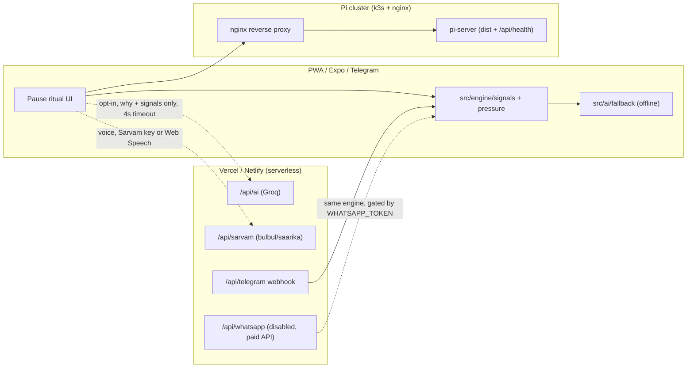
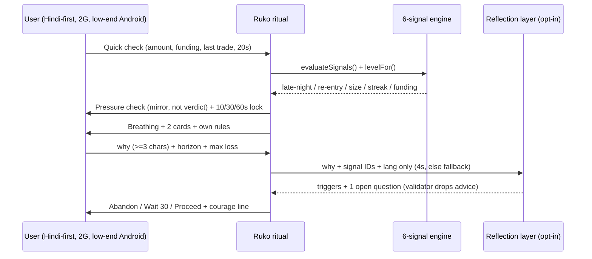
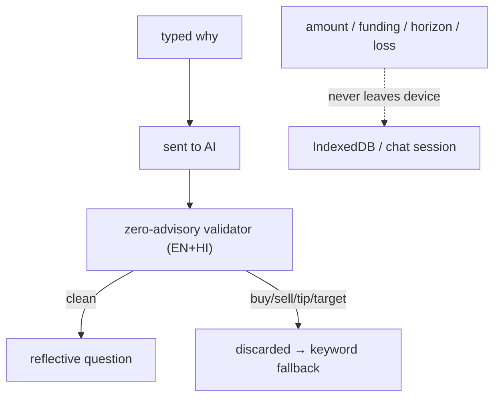

# Ruko (रुको) — Pre-Trade Pause Ritual & Decision Mirror

**SANGYAN Investor Resilience Hackathon**  
*Track D: Financial Habits & Behavioural Resilience*

---

## 1. What Ruko Is

Ruko (रुको) is a mobile-first, offline-capable Progressive Web Application (PWA) designed for retail investors in Tier-2 and Tier-3 India. 

Rather than acting on impulse or emotional distress, the user opens Ruko to complete a structured **pause ritual**:
1. **Screen 1 (Quick check):** Fast input of trade amount, funding source, and recent trade outcome.
2. **Screen 2 (Pressure check):** Real-time behavioral pressure check evaluating 6 distinct signals (late-night, rapid reentry after loss, size escalation, loss streak, risky funding, trading volume).
3. **Screen 3 (Reflection wait):** Conscious friction with a synchronized breathing circle, dynamic auto-advancing reflection cards with a "Keep this card" toggle, voice read-aloud via Web Speech, and your personal rules.
4. **Screen 4 (Decision):** Locked until the trader types at least 3 characters explaining *why* they want to make this trade, accompanied by time horizon and acceptable loss limits, leading to three conscious choices: *Abandon*, *Wait 30 minutes*, or *Proceed*.
5. **Screen 5 (Confirmation):** Immediate reinforcement acknowledging the pause with an uplifting courage quote ("That took a moment of courage. Nothing to prove.").

The same ritual also runs **inside Telegram** as a chat-native bot plugged into a webhook endpoint exposed by the app — no install needed, see [§5c](#5c-telegram-bot--chat-native-ruko-plug-in-webhook). A WhatsApp adapter ships in-repo with the same engine but stays **disabled by default** because it needs a paid WhatsApp Business API number — see [§5d](#5d-whatsapp-adapter--paid-api-gated).

---

## 1b. System at a glance (diagrams)







### End-to-end user experience (2 paths, same ritual)

**Web (PWA, airplane-mode capable):** Home → Pause now → pressure → breathe → why → abandon/wait/proceed → Journal → 7-day Mirror → Practice Late-night → Debrief with Pause ON vs OFF table. Full script in `JUDGE_DEMO.md`, plain-words guide in `HOW_TO_USE.md`.

**Chat (Telegram live, WhatsApp gated):** `/start` → `/pause` → amount number → funding/size/last-trade buttons → same 6 signals → breathing + cards → server-side 10/30/60s lock → why + horizon + loss → same reflection core → 3 choices → `/mirror` counts. Privacy identical: only why + signal IDs reach AI.

---

## 2. Practice Mode Dummy Trading Simulator

Ruko includes an offline, deterministic **Practice Simulator** allowing users to experience psychological market stress without risking real capital:
- **Permanent Safety Banner:** *"Practice money. Not real. Prices are random and cannot be predicted."*
- **5 Market Scenarios:**
  - `Calm day`: Small drift, minimal noise.
  - `Volatile day`: Large swings both directions.
  - `Sudden drop`: Rapid ~12% drawdown after an initial steady rise.
  - `Upward trap`: Sharp rise followed by sudden reversal.
  - `Late night`: Sim clock starts at 22:40 with prior loss seeded to trigger late-night and reentry pressure signals.
- **Fictional Instruments:** Demo Index, Demo Co. A, Demo Co. B, Demo Futures (5x leverage). No real market tickers or symbols.
- **Virtual Account:** Starting balance of ₹1,00,000, margin chips (10%, 25%, 50%), and 1x or 5x leverage.
- **Auto-Close Rule:** If unrealized position loss reaches or exceeds 90% of allocated margin, the position is automatically closed with an educational notice banner.
- **Integrated Pause Ritual:** When enabled, opening a position freezes the simulator clock and triggers the 5-screen pause ritual. Abandoning or delaying cancels the entry; proceeding opens it.
- **Session Debrief:** Comprehensive post-session analysis measuring total trades opened, rapid reentries (<= 5m after a loss), size escalation %, max drawdown %, realized P&L, pauses completed, observed pressure signals, an AI or rule-based reflection summary, and a self-reflection note prompt.

---

## 3. Opt-in AI Layer & Strict Data Privacy

Ruko features an optional, privacy-preserving AI assistant:
- **Default OFF:** Disabled by default with an explicit consent modal.
- **Privacy Guarantee:** With AI off, **nothing leaves your device** (zero network calls besides initial app asset loading). With AI on, **only** the typed why sentence (or aggregate counts for weekly/practice summaries), signal IDs, and language are sent. Never amounts, trades, funding sources, names, or personal identifiers.
- **Serverless API Proxy:** Requests route through `/api/ai` (Vercel) or `netlify/functions/ai` (Netlify) where API keys reside securely. No API keys exist in client bundles.
- **Rate Limited:** Server-side rate limiting caps requests to 20 calls per IP per hour.
- **Zero-Advisory Enforcement:** Server-side response validator checks every output for banned words. If the model attempts to advise on market direction or predict prices, the response is discarded and a deterministic fallback is served.
- **4-Second Timeout:** If the network is slow or offline, the client silently falls back to rule-based triggers and summaries without blocking the user.
- **Transparent Attribution:** Every AI-generated question or summary displays a badge explaining exactly why the content is shown.

---

## 4. Hard Guardrails

- **Zero Advisory:** No price targets, market sentiment predictions, or trading advice.
- **No Real Tickers or Broker APIs:** Strictly uses fictional instruments for practice and generic amounts for logging. No broker links, SMS/OTP access, or credentials.
- **Non-Judgmental Tone:** Objective mirroring of facts rather than moralizing labels.
- **Unblocked Proceed Option:** Slows traders down with mindful friction, but preserves autonomy.

---

## 5. Tech Stack

- **Framework:** React 18 + TypeScript (Strict Mode) + Vite
- **Styling:** Tailwind CSS, same midnight-diya palette throughout (Navy `#14213D`, Cream `#FAF6EE`, Saffron `#F2A33A`, Green `#2BB3A3`, Red `#E4572E`) applied as **soft neumorphism**: `shadow-neu` raised cards (abyss pocket + cream lip), `shadow-neu-in` pressed states, `neu-btn` saffron ritual actions. See `src/index.css` (§ neu primitives) and `docs/ARCHITECTURE.md` § visual language.
- **Routing:** `react-router-dom` (HashRouter for universal static hosting)
- **Local Storage:** `dexie` (IndexedDB v3)
- **PWA:** `vite-plugin-pwa` (precache + web app manifest)
- **Charts:** `recharts` (weekly mirror stacked bar chart and practice price line chart)
- **i18n & Speech:** `i18next`, `react-i18next` (12 languages: `hi` default, `en`, `bn`, `mr`, `ta`, `te`, `kn`, `ml`, `gu`, `pa`, `or`, `as`), Sarvam AI voices (bulbul TTS / saarika STT via `/api/sarvam`, key in `SARVAM_API_KEY`) with on-device Web Speech fallback
- **Testing:** `vitest`
- **Telegram Bot:** chat-native ritual via the `/api/telegram` webhook (serverless, no bot framework dependency — plain Bot API calls)
- **WhatsApp adapter:** same ritual via `/api/whatsapp`, disabled by default (needs paid Business API number)
- **Deploy:** Docker image + `docker-compose.pi.yml` for single Pi, `k8s/` manifests for a multi-Pi (k3s) cluster behind nginx
- **Grading shortcut:** `GRADING.md` (verify in 5 min) · **Ops:** `OPERATIONS.md` · **Security:** `SECURITY.md` · **Design:** `docs/ARCHITECTURE.md`

---

## 5b. Mobile App (Expo) & Releases

- **`mobile/`** is the native Expo companion (SDK 57): same ritual, journal,
  simulator, and 12 languages with a polished midnight-diya theme.
  Storage is on-device AsyncStorage; voice is Sarvam-first with expo-speech
  fallback. See `mobile/README.md`.
- **Releases** are automated in `.github/workflows/release.yml`:
  push a `v*` tag (or dispatch manually) to run web tests + build, Expo
  typecheck + web export, an optional EAS preview APK (needs the `EXPO_TOKEN`
  secret), and publish a GitHub Release with both web bundles attached.

```bash
git tag v1.2.0-pi && git push origin v1.2.0-pi
```

---

## 5c. Telegram Bot — Chat-native Ruko (Plug-in Webhook)

Ruko exposes a **Telegram webhook endpoint** at `/api/telegram` on every host that already serves the app's serverless routes (Vercel, Netlify, and the local `vite dev` shim). Point any bot token at it once, and the full **5-screen pause ritual runs as a native Telegram conversation** — no app install, works on slow networks, same guardrails.

### How a bot plugs into the endpoint

```bash
# 1. Create a bot with @BotFather, then set the env vars (see §7):
#    TELEGRAM_BOT_TOKEN, TELEGRAM_WEBHOOK_SECRET (recommended)

# 2. Deploy the app as usual (Vercel / Netlify), then run ONE command:
npm run bot:set-webhook -- https://your-app.vercel.app
#    ...or do it manually:
curl "https://api.telegram.org/bot<TOKEN>/setWebhook" \
  -d "url=https://your-app.vercel.app/api/telegram" \
  -d "secret_token=<TELEGRAM_WEBHOOK_SECRET>" \
  -d 'allowed_updates=["message","callback_query"]'
```

That's it — the endpoint is stateless to Telegram (it only receives updates and replies through the Bot API), so it plugs into any bot token. A `GET /api/telegram` health check returns the service status.

### What the user gets (ritual → chat mapping)

| App screen | Telegram experience |
| --- | --- |
| Screen 1 · Quick check | `/pause` → amount (typed), funding / usual-size / last-trade / trades-today as inline-button taps |
| Screen 2 · Pressure check | The same **6 behavioral signals** (late-night, many trades today, quick re-entry after loss, size escalation, loss streak, risky funding) evaluated with the app's engine (`src/engine`), levels and wording mirrored from `src/i18n` — *"Nothing here is a verdict. It is a mirror."* |
| Screen 3 · Reflection wait | Breathing instructions + reflection cards (the same loss-math and SEBI snippets), with the decision button **locked server-side** for the level's friction window (calm 10s / caution 30s / high 60s) — early taps get *"Still breathing… Xs left."* |
| Screen 4 · Decision | Requires typing a why (≥3 chars), time horizon, acceptable-loss limit — then triggers + one open reflective question from the **same reflection layer as `/api/ai`** — then the three conscious choices as buttons: *Abandon*, *Wait 30 minutes*, *Proceed anyway* |
| Screen 5 · Confirmation | *"That took a moment of courage. Nothing to prove."* — plus a come-back time for the wait choice |

**Commands:** `/start` (bilingual onboarding) · `/pause` · `/mirror` (pause counts) · `/checkin` · `/lang` · `/cancel` · `/help`. Both **Hindi (default)** and **English** are fully supported, mirroring the app's tone and copy.

### Privacy & guardrails (identical contract to the app)

- **Shared reflection core:** the bot calls the same prompts, JSON cleanup and **server-side zero-advisory validator** as `/api/ai` via the shared `api/ai-core.ts` — one code path, one guardrail. If the model tries to advise, the output is discarded and a deterministic keyword fallback (`src/ai/fallback.ts`) is used.
- **Minimal data:** only the typed why sentence, fired signal IDs and language ever reach the AI layer. Amounts, funding, horizon and loss limits never leave the chat session — enforced by tests (`api/telegram-bot.test.ts`).
- **No advice:** same hard rules — no tickers, no price direction, no strategy, autonomy preserved (Proceed always available).
- **Webhook security:** set `TELEGRAM_WEBHOOK_SECRET` and Telegram must echo it in `X-Telegram-Bot-Api-Secret-Token` on every update, or the request is rejected with 401.
- **Session state:** per-chat, in-memory, 24h TTL (best-effort on serverless cold starts; wire Redis/Vercel KV if you need durability). Mirror counters live in the same session — never synced with the app's on-device journal.

### Local development

`vite dev` serves `/api/telegram` in-process via the dev shim, so you can test against a real bot:

```bash
ngrok http 5173          # or: cloudflared tunnel --url http://localhost:5173
npm run bot:set-webhook -- https://<your-tunnel>.ngrok-free.app
npm run dev
```

---

## 5d. WhatsApp adapter (paid-API gated)

`api/whatsapp.ts` reuses the exact Telegram conversation reducer and the shared `api/ai-core.ts` reflection layer (same 6 signals, same 10/30/60s server lock, same zero-advisory validator, same minimal-data contract). It is **disabled by default**: without `WHATSAPP_TOKEN` + `WHATSAPP_PHONE_NUMBER_ID` the endpoint returns `503` with a plain-words reason and the app/Telegram paths are unaffected — verified by `api/whatsapp.test.ts`.

Why gated: WhatsApp Cloud API needs a paid business number and Meta verification. The code is complete and covered by tests, but there is no public demo number on the free tier, so judges should grade Telegram (live) as the chat-native proof and treat WhatsApp as code-verified, not demo-verified.

```bash
# Enable only when you hold a Meta business number:
WHATSAPP_TOKEN=... WHATSAPP_PHONE_NUMBER_ID=... WHATSAPP_WEBHOOK_VERIFY_TOKEN=...
curl "https://your-app/api/whatsapp?hub.mode=subscribe&hub.verify_token=$WHATSAPP_WEBHOOK_VERIFY_TOKEN&hub.challenge=test"
```

---

## 6. How to Run Locally

### Install dependencies:
```bash
npm install
```

### Run development server:
```bash
npm run dev
```

### Run tests:
```bash
npm test
```

### Build production bundle:
```bash
npm run build
```

---

## 7. How to Deploy to Vercel or Netlify

### Environment Variables (Optional for AI Layer):
- `GROQ_API_KEY`: Your Groq Cloud API key (console.groq.com → API Keys; configured as a secret in Vercel/Netlify dashboard). The `GEMINI_API_KEY` slot is still accepted as a fallback, so existing deployments keep working.
- `AI_MODEL`: Groq model to use (defaults to `llama-3.3-70b-versatile`).

### Environment Variables (Optional for Sarvam Voices):
- `SARVAM_API_KEY`: Your Sarvam AI API key (dashboard at https://dashboard.sarvam.ai). Powers `/api/sarvam` — natural TTS (bulbul), speech-to-text (saarika), and translation (Mayura) across all 12 app languages. Without it the app silently uses on-device Web Speech. See `.env.example`.

### Environment Variables (Optional for the Telegram Bot):
- `TELEGRAM_BOT_TOKEN`: Bot token from @BotFather. Enables the `/api/telegram` webhook endpoint (see §5c).
- `TELEGRAM_WEBHOOK_SECRET`: Recommended shared secret — Telegram must echo it in the `X-Telegram-Bot-Api-Secret-Token` header on every update or the request is rejected with 401.
- After deploying, point your bot at the endpoint once: `npm run bot:set-webhook -- https://your-app.vercel.app`

### Environment Variables (WhatsApp adapter — paid, OFF by default):
- `WHATSAPP_TOKEN`, `WHATSAPP_PHONE_NUMBER_ID`: Meta Cloud API credentials (paid business number required). Without them `/api/whatsapp` returns 503 by design — see §5d.
- `WHATSAPP_WEBHOOK_VERIFY_TOKEN`: verifies the Meta subscribe handshake.

### Deploying to Vercel:
1. Connect this repository to Vercel (or run `npx vercel`).
2. Settings:
   - **Framework Preset:** Vite
   - **Build Command:** `npm run build`
   - **Output Directory:** `dist`
3. In Project Settings -> Environment Variables, add:
   - `GROQ_API_KEY`: `gsk_...`
   - `AI_MODEL`: `llama-3.3-70b-versatile` (optional)
4. The serverless route `/api/ai.ts` is automatically detected and served by Vercel. `/api/telegram.ts` (if you add the Telegram env vars) is detected the same way.
