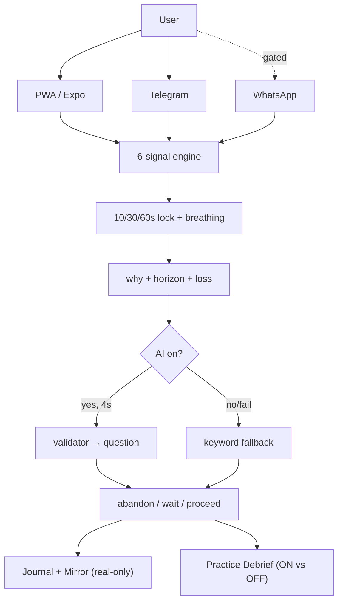

# ARCHITECTURE — how Ruko is built and how it gets better

## Current system (what runs today)
- Client: React 18 PWA (HashRouter, Dexie IndexedDB v3, workbox precache) + Expo SDK57 sibling. 12 langs, Web Speech with Sarvam fallback, 48px targets, reduced-motion respected.
- Engine: `src/engine/signals.ts` (6 deterministic signals) → `levelFor()` (calm/caution/high) → friction 10/30/60s lock. No network, no clock tricks (sim freezes during ritual).
- Reflection: opt-in AI via `api/ai-core.ts` (Groq JSON mode) with `api/validate.ts` EN+HI guardrail. 4s client timeout → `src/ai/fallback.ts` keyword triggers. Every AI string carries a badge saying why it shows.
- Channels: same reducer serves PWA, `/api/telegram` (live), `/api/whatsapp` (paid-gated, 503 without token). Telegram sessions: 24h TTL in-memory, file-backed on Pi via `RUKO_SESSION_FILE`.
- Edge: nginx serves `dist/` (immutable hashed assets, no-cache `sw.js`), proxies `/api/*` with 4-5s timeouts. Single Pi: `server/pi-server.mjs` + systemd. Multi-Pi: same Docker image under k3s (`k8s/`, 2 replicas, `/api/health` probes).
- Proof: `eval/cases.json` (25) in CI, 135+ vitest checks, `scripts/audit-pwa.mjs`, evidence pack + `RUKO1.` encrypted backup.
- Visual language: clean institutional light theme on web + Expo — white surfaces, `#F4F6FA` app bg, navy ink, hairline `#E2E8F0` borders, one soft gray shadow. Saffron fills mark only the ritual action (Pause button, primary CTAs, selected states); Clay `#92400E` carries small accent text at readable contrast; chart up/down uses green/red bodies with hollow-down shapes so color is never the only signal. Rule: features first, color second — no glow, grain, or decoration that costs contrast on 2GB phones.

## End-to-end journeys (for graders and future AI review)
1. First pause (web): Home → amount 20000 + loan + loss 10m at 23:10 → high pressure → breathe 60s → why → wait → courage line → Journal + Mirror update.
2. Chat pause (Telegram): `/pause` → number → 4 button taps → same signals → server lock → why → 3 choices → `/mirror`.
3. Learning loop (practice): Late-night scenario → open fast → ritual freezes clock → Debrief shows re-entry/size/drawdown → second run shows Pause ON vs OFF delta.

## Improvements that raise the rating (roadmap, rubric-linked)
1. Durable chat sessions (Buildability): move Telegram/WhatsApp sessions from memory/file to Vercel KV/Redis with the same 24h TTL interface (`api/telegram-store.ts` already isolates storage). No UX change, kills cold-start drops.
2. Queued reflection worker (Technical): put Groq calls behind a tiny queue with retry-once + validator-first ordering, keeping the 4s client budget. Same contract, fewer 502s on flaky networks.
3. Voice streaming (Usefulness 40%): stream Sarvam TTS per card instead of per screen; keep Web Speech instant fallback. Biggest Tier-2 win: less waiting on 2G.
4. Eval growth (Technical/Integrity): extend `eval/cases.json` past 25 with real anonymized whys (opt-in export via evidence pack) + nightly prompt-regression job. Catches validator drift.
5. Mirror coaching without advice (Innovation): weekly "you paused X of Y urges" trend + streak-safe copy review by guardrail tests. Never a verdict, never a tip.
6. Pi observability (Buildability): ship Promtail/Grafana-lite dashboard for `/api/health` + nginx error rate + eval PASS in CI badge. Judges see green without SSH.

Each item keeps the hard rules: amounts never leave, proceed always present, practice never pollutes real Mirror, paid channels off by default.
